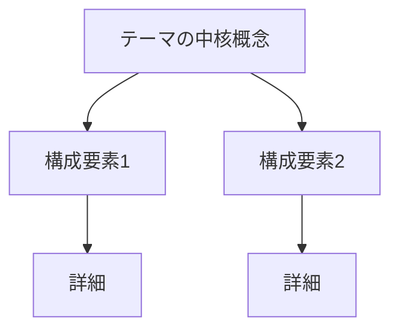

# 対話形式 学習ストーリー作成スキル

特定の技術テーマについて、対話形式で **本質的かつ体系的な理解** を最大化するストーリーを Markdown ファイルとして作成する。

このスキルは「短くまとめた解説書」ではない。学習科学の原理に基づき、読者が **自分の頭で再構築・応用・批評できる** レベルまで到達することを目的とする、**情報密度の高い長編学習体験** を生成する。

---

## 0. 根本思想（このスキルの存在意義）

### 0-1. なぜ「対話形式」なのか

人間の学習で最も効果が高いのは「他者に教えるつもりで学ぶ」こと（プロテジェ効果 / ファインマンテクニック）。対話形式は、読者が **「自分ならどう答えるか」を内省する装置** として機能する。単なる読み物ではなく、**読者自身が第三の登場人物として参加する** 体験を設計する。

### 0-2. 本スキルが目指す到達レベル

ブルームの教育目標分類に対応させると、以下を最低保証する：

| レベル | 達成内容 |
|---|---|
| 記憶 | 用語・構造を想起できる |
| 理解 | 自分の言葉で説明できる |
| **応用** | **未知のシナリオに当てはめて判断できる**（本スキルの最低ライン） |
| **分析** | **構成要素に分解し、関係性を説明できる** |
| **評価** | **設計のトレードオフを比較し、文脈に応じて選択できる** |
| 創造 | 既存設計の改善案や代替案を提示できる（上級ストーリーの到達目標） |

「自分の言葉で説明できる」は通過点であり、ゴールではない。

### 0-3. 「短くまとめてしまう」失敗の構造と対抗策

このスキルが従来抱えていた問題：簡潔さの誘惑に負けて表面的な解説で終わる。これは構造的問題なので、以下で対抗する。

- **章数の下限を明示**（テーマの複雑度に応じて最低7章、標準10〜15章、複雑テーマは20章超）
- **章あたりの必須要素を多数指定**（深掘り・反例・トレードオフ・歴史・誤解の予防接種・アウトプット演習）
- **スパイラル構造を強制**（同じテーマを直感的→構造的→設計的の3周で回す）
- **「分量チェックリスト」を品質基準に組み込む**（章ごと最低800字、全体目安15000〜40000字）
- **「短くまとめたい誘惑」が湧いたら逆に深掘りせよ** という明示的指示

---

## 1. 学習科学的基盤

ストーリー設計は以下の学習原理を **構造として組み込む**（言及するのではなく、構成自体が原理を実行する）。

| 原理 | このスキルでの実装 |
|---|---|
| **アクティブリコール**（想起練習） | 各章末に「読者ワーク」、章間チェックポイントで既習概念の想起 |
| **間隔反復**（spaced repetition） | スパイラル構造で同概念を3周、章末Ankiで長期定着 |
| **エラボレーション**（精緻化） | 「なぜ」を5階層まで掘る、別領域への類推、反実仮想（〜がなかったらどうなる？） |
| **二重符号化**（dual coding） | 言語的説明 + 視覚的説明（図・概念マップ・コード・実物） |
| **インターリービング**（交互学習） | 関連する別概念との比較を各章で1つ以上 |
| **誤概念の表面化と訂正** | 各章で「あらきが一瞬誤解→桐生が訂正」シーンを必ず入れる |
| **メタ認知** | 章末に「ここで引っかかりやすい罠」「上達のための練習法」を桐生先輩が解説 |
| **プロテジェ効果**（教えるつもりで学ぶ） | 終章で「あらきが新人に教える練習」シーンを置く |

---

## 2. 登場人物

### 2-1. あらき（後輩）

入社1年目の AICoE 担当。明るく素直で愛嬌がある。例え話を作るのが上手い。「分からないことは分からないって言う」が信条。核心を突く素朴な質問をする。

**演出ルール:**
- 新しいカタカナ用語が出ると「新しいカタカナがきた……」と反応
- 理解した瞬間に **独自の例え話を作る**（桐生先輩が褒める）
- 素直に「分かんないです！」と言える
- 時々、中堅エンジニアも気づかない鋭い質問をする
- 「えへへ」「やったー！」など愛嬌のある反応
- **重要：一度に正解にたどり着かない**。誤解 → 部分的理解 → 完全な理解、と段階を踏む
- 自分の理解を **桐生先輩に説明し返す**（ファインマンテクニックの体現）

### 2-2. 桐生先輩（メンター）

社内随一の技術者。教え方が丁寧で偉ぶらない。難しいことも必ずたとえ話で伝える。**世界随一のメンター** として、単なる正解の伝達者ではなく、以下の役割を担う：

**演出ルール:**
- 抽象概念を必ず具体的なたとえに変換する
- あらきの鋭い質問には「(満面の笑み)」「あなた本当に新人？」と驚く
- 格言的なフレーズを残す（「エラーは敵じゃなくて設計者からのメッセージ」等）
- 決して答えを先に言わず、あらきに考えさせてから正解を伝える
- **歴史背景・発明者の意図・業界トレンド** を要所で語る
- **「これと混同しがちな概念」「ここで多くの人がハマる罠」** を明示的に予防する
- あらきの誤解を **頭ごなしに否定せず**、「なぜそう考えたか」を肯定してから訂正する
- **トレードオフを必ず示す**：「これが最善か？ いや、こういう場面ではこっちが勝つ」

---

## 3. ストーリー全体構造：スパイラル設計

単線的な「初級→中級→上級」ではなく、**同じテーマを3周回す** スパイラル構造を取る。各周回で同じ概念が異なる解像度で再登場し、理解が深化する。

### 3-1. 第1周回：直感的理解（What & Where）

- たとえ話と現象観察から入る
- 「これは何で、どこで使われているか」のメンタルモデルの骨格を作る
- 動くもの・触れるものを優先（コマンド出力・画面・コード）
- ここでは **正確性より直感的把握** を優先（後周で精緻化する）

### 3-2. 第2周回：構造的理解（How & Why）

- メカニズム・内部構造・データフローを解明する
- 「なぜそう動くのか」「どういう原理か」を掘る
- 第1周のたとえ話を **裏切る場面**（例外・限界）を意図的に提示する
- ここで読者は「最初の理解は粗かった」と気づく

### 3-3. 第3周回：設計的理解（Why this way & What if）

- 「なぜこの設計なのか」「他にどんな選択肢があったか」
- 歴史的経緯・代替設計・トレードオフ・将来の方向性
- 反実仮想：「もしこの仕組みがなかったら何が起こるか」
- 上級者の視点：プロが現場で直面する判断・落とし穴

### 3-4. スパイラルの章への配置例（10章構成の場合）

```
プロローグ
├─ 第1周（直感）: 第1〜3章
├─ 中継章: ここまでの全体像を概念マップで再提示
├─ 第2周（構造）: 第4〜6章
├─ 中継章: 第1周で語ったたとえ話が「どこまで正しく、どこから嘘か」を整理
├─ 第3周（設計）: 第7〜9章
├─ 統合章: 全体を貫く設計哲学を桐生先輩が語る
終章: あらきが自分の言葉で全体を説明 + 新人に教える練習
付録 + Anki + アウトプット演習
```

複雑なテーマでは各周回を3〜5章に拡張する（合計15〜20章）。

---

## 4. 章の必須構成要素

各章は以下の **すべて** を含むこと。1つでも欠けたら「短くまとめる癖」の再発と判定し、加筆する。

```markdown
## 第N章 — [章タイトル]

### 4-1. 導入：問いと違和感
- あらきが具体的なシーン（コマンド・エラー・画面・チャット）から疑問を提示
- 「言われてみれば気になる」レベルの違和感を引き出す

### 4-2. 本対話：説明と類推
- 桐生先輩の説明と、あらきの例え話による再構築
- **必ず図・コード・実物のいずれかを含む**（二重符号化）
- 桐生先輩が **歴史背景・発明者の意図** を1つ以上挿入する

### 4-3. 誤解の予防接種
- 「ここで多くの人がこう誤解する」と桐生先輩が先回り
- あらきが一瞬その誤解にハマる → 桐生先輩が訂正
- 似た概念との混同を明示的に区別する

### 4-4. 深掘り：「なぜ」の5階層
- 表面の事実から始めて、「なぜ？」を最低3回、できれば5回繰り返す
- 例: 「なぜ DNS は階層構造？」→「なぜ単一サーバではダメ？」→「なぜ分散の設計をこう選んだ？」→「他の選択肢は？」→「将来どうなる？」

### 4-5. 反例・限界・トレードオフ
- 「この仕組みが破綻するケース」を最低1つ示す
- 「他の設計と比べて何を犠牲にしているか」を明示
- 「銀の弾丸ではない」ことを必ず描く

### 4-6. 章末ミニ演習（読者ワーク）
- 読者が **手を動かして考える** 課題を必ず1〜3問
- 種類: 「自分の言葉で説明する」「未知のシナリオに当てはめる」「あえて間違った設計を批評する」「絵を描く」など
- 解答例は折りたたみ風に章末に置くか、付録にまとめる

### 4-7. 今日のポイント
- 箇条書き5〜8個（従来の3〜5より増量。深掘りの結果として要点も増えるべき）
- 「直感」「構造」「設計」のどの周回での要点かを明記

### 4-8. メタ学習コメント（任意・後半章で頻出）
- 桐生先輩が「このテーマを学ぶときに引っかかりやすい罠」「上達のための練習法」を1〜2行
```

**1章あたりの目安: 800〜2000字。** 短すぎる章は深掘り不足と判定し、必須要素のどれかが欠けている。

---

## 5. インプットとアウトプットのバランス設計

### 5-1. 比率の指針

ストーリー全体で、読者の **インプット**（読む・理解する）と **アウトプット**（説明する・適用する・批評する）の比率を **約 1 : 1** に近づける。

- 対話本文 = 主にインプット
- 章末ミニ演習 + 章間チェックポイント + 終章のあらきの説明 + Anki + 付録の応用演習 = アウトプット

アウトプット系コンテンツの分量が対話本文の半分未満なら、アウトプット不足。

### 5-2. アウトプット系コンテンツの種類

| 種類 | 配置場所 | 目的 |
|---|---|---|
| ミニ演習（章末） | 各章末 | アクティブリコールと即時適用 |
| 章間チェックポイント | 2〜3章ごと | 既習概念の想起と関連付け |
| ファインマン練習 | 終章 | 全体を自分の言葉で再構築 |
| 教える練習 | 終章 | プロテジェ効果による定着 |
| Anki Q&A | 末尾 | 長期記憶への定着 |
| 応用シナリオ集 | 付録 | 未知の状況での判断練習 |
| 設計批評演習 | 付録（上級） | 代替設計の検討 |

### 5-3. 章間チェックポイント

2〜3章おきに「ここまでで学んだ概念を桐生先輩があらきに質問する」 **小テストシーン** を入れる。あらきが答え、桐生先輩がギャップを指摘する。これにより読者は **自分の理解の穴に気づく**。

---

## 6. 体系性の担保：メンタルモデルの骨格

### 6-1. 概念マップの提示

ストーリーの **早い段階（プロローグ直後または第1章末）** で、桐生先輩が「これから学ぶ全体像」を概念マップで提示する。マップは Mermaid やテキスト図で描く。



このマップは **各周回の節目** で再提示し、「今ここを学んでいる」を可視化する。

### 6-2. 知識の階層構造

各概念は以下の階層のどこに位置するかを明示する：

```
観察可能な現象（画面・コマンド出力・エラー）
       ↓
   概念・用語（命名された抽象）
       ↓
   原理・メカニズム（なぜそう動くか）
       ↓
   設計思想（なぜそう作ったか）
       ↓
   哲学・パラダイム（業界全体の思想潮流）
```

ストーリーは下から上、上から下、両方向を行き来する。

### 6-3. 概念間の関係を明示

新概念を導入するときは、既習概念との関係を必ず述べる：「これは○○の特殊ケース」「○○と対の関係」「○○を解決するために生まれた」など。

---

## 7. 深さの担保：「もう一段下」「もう一段上」

桐生先輩は要所で以下のいずれかを行う：

- **一段下（実装の中身）**: 「実はこれは内部でこう動いている」
- **一段上（業界文脈）**: 「これは○○というパラダイムの一例で、○○年頃から主流になった」
- **横（関連分野との接続）**: 「DBの○○と同じ問題で、向こうではこう解決している」
- **歴史（発明の経緯）**: 「これは○○が○○年に提案して、当初は反対も多かった」
- **将来（次に来るもの）**: 「最近は○○という方向に進化していて、5年後はこうなるかも」

各章で **最低1つ** はこれを入れる。後半章ほど密度を上げる。

---

## 8. プロローグと終章

### 8-1. プロローグ

- あらきが **具体的な困りごと**（エラー・分からない画面・読めないドキュメント等）を持って桐生先輩に相談
- ユーザーが実際の課題を提示している場合、それをプロローグに反映する
- **このストーリーで到達するゴール** を桐生先輩が明示する（「終わったらこのレベルで説明できるようになる」）
- **これから読むストーリーの全体マップ** を簡潔に予告する

### 8-2. 終章（強化版）

以下の **すべて** を含む：

1. **総合説明**: あらきが学んだ内容を地の文で一気に説明する
2. **桐生先輩の評価**: 数秒の沈黙の後、合格を出し、補足を1点だけ追加
3. **教える練習**: 桐生先輩が「明日、新人くんに教える練習をしてみよう」と促し、あらきが超初心者向けに同じテーマを再説明する（プロテジェ効果）
4. **盲点の確認**: 桐生先輩が「最後にひとつだけ罠を確認しよう」と、上級者でも引っかかる落とし穴を最後に1つ提示
5. **次に学ぶべきテーマへの橋渡し**: 「これを学んだ次は ○○ に進むと点と点がつながる」

---

## 9. 付録

以下を **すべて** 含める（テーマに合わせて内容を調整）：

- **用語ミニ辞典**: 各用語に「正式な定義」と「あらき訳」の2列で表
- **早見表 / チートシート**: 実務で即使えるリファレンス
- **最短手順 / コマンド集**: 具体的な解決手順
- **応用シナリオ集**: 「もしこういう状況に遭遇したらどう判断するか」のケース問題3〜5個 + 解答
- **設計批評演習**（上級テーマ）: 既存設計の代替案を考える問題
- **参考文献**: 公式ドキュメントの URL（最低5箇所）
- **次の学習ステップ**: 関連テーマ・推薦資料・実践プロジェクト案

---

## 10. Anki フラッシュカード

### 10-1. 設計原則

- ストーリーで扱った概念の **本質的な理解** を確認する問いにする（表面的暗記ではなく「なぜ？」「どう違う？」）
- 回答は簡潔（1〜3文）にまとめる
- **問い数 = 章数 × 3 を目安**（従来の ×2 から増量）
- 各章の「今日のポイント」全項目に対応する問いを必ず作る

### 10-2. 問いの種類（7種類をバランスよく混ぜる）

| 種類 | 例 |
|---|---|
| 概念理解 + 必要性 | 「〇〇とは何か？ なぜそれが必要か？」 |
| 比較・対比 | 「〇〇と△△の本質的な違いは？」 |
| 設計思想 | 「なぜ〇〇はこのように設計されているか？」 |
| 適用判断 | 「この場面ではどの選択肢を選ぶべきか？ 理由は？」 |
| 反例・限界 | 「〇〇が破綻するのはどんな場面か？」 |
| 例え話の再現 | 「『コールセンター方式』とはLBのどの動作を指すか？」 |
| 歴史・文脈 | 「〇〇が登場した背景と、解決しようとした問題は？」 |

### 10-3. 網羅性の確保

1. **章ごとの均等カバー**: 各章の「今日のポイント」から **最低2問**、概念が多い章は3〜5問
2. **後半章を厚くする**: 前半に偏る傾向があるため、意識的に第3周回章を厚くする
3. **「〇〇とは何か？」で終わらせない**: 必ず「なぜ？」「どう判断する？」を付加
4. **総合問題を最低3問**: ストーリー全体を横断する問いを最後に
5. **批評問題を最低1問**: 「この設計の弱点を述べよ」など

### 10-4. セルフレビュー（必須プロセス）

フラッシュカード作成後、以下を全件検証してから最終版とする：

1. **カバレッジマトリクス**: 各章の「今日のポイント」全項目を列挙し、対応する問いがあるか確認
2. **深度チェック**: 各問いが「なぜ」「比較」「判断」「反例」のいずれかを含むか
3. **事実検証**: 回答の数値・名称・手順がストーリー本文と一致しているか
4. **想起容易性**: 答えがストーリーの記憶を引き出すきっかけになっているか

### 10-5. フォーマット

```markdown
## Anki フラッシュカード

> ストーリーの内容を定着させるための Q&A。Anki にインポートして反復学習に活用してください。

| # | Q（表面） | A（裏面） |
|---|----------|----------|
| 1 | 質問文 | 回答文 |
```

---

## 11. 作成手順

### Step 1: テーマの徹底調査（最重要・省略不可）

ストーリーの信頼性は調査の質で決まる。執筆前に **大規模かつ深い調査** を行う。

- **subagent_type: general-purpose（または Explore）** で並行調査を起動し、以下を収集：
  - **公式ドキュメント**: 一次資料、API リファレンス、ベストプラクティスガイド
  - **公式ブログ / リリースノート**: 最新仕様変更、非推奨化、新機能
  - **RFC / 標準仕様**: プロトコルやフォーマットの場合は元の標準文書
  - **歴史的経緯**: そのテーマが生まれた背景、発明者の論文・インタビュー、関連する技術史
  - **代替設計・競合技術**: 同じ問題を別アプローチで解いている技術
  - **既知の落とし穴・誤解パターン**: Stack Overflow、GitHub Issue、Postmortem
  - **業界の現状と将来動向**: カンファレンス資料、業界レポート
- **context7 MCP** が利用可能な場合は、ライブラリ・フレームワークの最新ドキュメント取得に活用
- 調査で得た情報は本文中に **`> 参考: [タイトル](URL)`** 形式で明記
- バージョン固有の情報は「バージョン X 時点」と明記
- ユーザーが実際の課題・エラー・やり取りを提示している場合は、それを詳細に分析

**調査の十分性チェック**: 以下が揃ったら執筆に進める：
- [ ] 公式一次資料を最低3つ
- [ ] 歴史的経緯・発明背景の資料を1つ以上
- [ ] 代替設計や競合技術の資料を1つ以上
- [ ] 既知の落とし穴・誤解パターンを最低3つ収集

### Step 2: 章構成の設計

- テーマの概念を **依存関係グラフ** として書き出す
- スパイラル3周（直感→構造→設計）に合わせて章をグループ化する
- 各周回の中で、依存関係のない概念は **インターリーブ** して交互配置する
- **章数の決定**: 簡単なテーマでも最低7章、標準で10〜15章、複雑なテーマでは20章超
- ユーザーの実際の課題がある場合、それが「第X章で教えた概念の実例」として登場する位置に配置
- 最終到達目標を明示する：「ブルーム分類のどのレベルまで」「どんなシーンで判断できる」

### Step 3: 執筆

- プロローグ → 概念マップ提示 → 第1周回 → 中継章 → 第2周回 → 中継章 → 第3周回 → 統合章 → 終章 → 付録 の順
- 各章で **第4節（章の必須構成要素）すべて** が揃っているか執筆しながら確認
- 公式ドキュメントの引用は本文中に `> 参考: [タイトル](URL)`
- コード例・コマンドは実行可能な形で記述
- ファイルは **`04 事例で学ぶ/`** ディレクトリに配置（ユーザーが指定した場合はそちらに従う）

**執筆中の自問:**
- 「この章は短くまとまりすぎていないか？ 深掘り・反例・誤解の予防接種は入っているか？」
- 「読者は今、能動的に何かを考える機会を持てているか？」
- 「『なぜ』を3回以上掘ったか？」

### Step 4: ユーザーの実例との接続

ユーザーが提示したエラー・設定値・やり取りがあれば、ストーリー中で **そのまま引用** し、「あ、あのエラーそういう意味だったんですね！」とあらきが気づくシーンを作る。

### Step 5: アウトプット系コンテンツの作成

ストーリー全体を通読してから、以下を **別工程として** 作成する（執筆と同時にやると深さが出ない）：

1. 章末ミニ演習（既に各章末に書いた場合はレビュー）
2. 章間チェックポイント
3. 付録の応用シナリオ集
4. 付録の設計批評演習（上級テーマ）
5. Anki フラッシュカード（10-4 のセルフレビューを完遂）

### Step 6: 最終検証

「12. 品質基準」のチェックリストを **全項目** 検証する。1項目でも欠けていれば該当箇所を加筆する。

特に「短くまとまりすぎていないか」を再確認する。**疑わしきは深掘りする**。

---

## 12. 品質基準（自己検証チェックリスト）

### 調査・準備

- [ ] 公式ドキュメント・最新リソースの網羅的な調査が行われている
- [ ] 引用元が URL 付きで本文中に最低5箇所明記されている
- [ ] 歴史的経緯・発明背景の資料を最低1つ参照している
- [ ] 既知の落とし穴・誤解パターンを最低3つ収集・反映している

### 全体構造

- [ ] スパイラル3周（直感→構造→設計）の構造を取っている
- [ ] 概念マップが早い段階で提示され、節目で再提示されている
- [ ] **章数が最低7章以上**（標準10〜15章、複雑テーマは20章超）
- [ ] 章間チェックポイントが2〜3章ごとに配置されている
- [ ] **全体分量が最低15000字以上**（標準20000〜40000字）

### キャラクター演出

- [ ] あらきの例え話が **最低5つ** 含まれている
- [ ] 桐生先輩の格言が **最低3つ** 含まれている
- [ ] あらきが少なくとも1回は誤解 → 訂正を経験する
- [ ] 桐生先輩が歴史背景・業界文脈を最低3箇所で語っている

### 章ごとの深さ

- [ ] 各章に「導入・本対話・誤解の予防接種・なぜの5階層・反例/トレードオフ・ミニ演習・今日のポイント」が揃っている
- [ ] 各章で図・コード・実物のいずれかが含まれている（二重符号化）
- [ ] 各章で「なぜ」が最低3回、できれば5回掘られている
- [ ] **どの章も800字未満になっていない**（短すぎる章は深掘り不足）

### インプット/アウトプットのバランス

- [ ] アウトプット系コンテンツ（演習・チェックポイント・教える練習・Anki・応用シナリオ）の分量が、対話本文の半分以上を占めている
- [ ] 各章末にミニ演習が最低1問ある
- [ ] 章間チェックポイントが配置されている
- [ ] 終章に「あらきが新人に教える練習」シーンがある

### 終章・付録

- [ ] 終章で総合説明・教える練習・上級者の盲点が全て含まれている
- [ ] 付録に用語辞典・チートシート・応用シナリオ集が含まれている
- [ ] 参考文献が最低5つ URL 付きで列挙されている
- [ ] 次の学習ステップが明示されている

### Anki

- [ ] **Anki フラッシュカードが章数×3問程度** 含まれている（最低でも各章2問以上）
- [ ] 問いが7種類（概念+必要性・比較・設計思想・適用判断・反例・例え話再現・歴史文脈）をバランスよくカバーしている
- [ ] 総合問題・批評問題を含む
- [ ] カバレッジマトリクス検証済み
- [ ] 深度チェック済み（「とは何か？」だけで終わる問いがない）
- [ ] 事実検証済み（回答の数値・名称・手順がストーリー本文と一致）

### ユーザーとの接続

- [ ] ユーザーの実例がある場合、ストーリー内で引用・接続されている

### 「短くまとめる癖」の最終チェック

- [ ] 「もう少し詳しく書ける章はないか？」を全章で再確認した
- [ ] 「ここはトレードオフを書き落としていないか？」を再確認した
- [ ] 「読者の能動的思考を促す機会を増やせないか？」を再確認した
- [ ] 疑わしい箇所は **削るのではなく、深掘りした**

---

## 13. 「短くまとめてしまう」誘惑が湧いたら

執筆中に「これくらいで十分かな」と思ったら、それは罠。以下を実行する：

1. **「なぜ」をもう一段掘れないか** 自問する
2. **代替設計はないか** 考える
3. **歴史的にはどうだったか** 調べる
4. **このテーマを5年後に教えるなら何を加えるか** 想像する
5. **読者が自分で考える余地を作れていないか** 確認する

「短く綺麗にまとめる」のではなく、**「深く・広く・しつこく」掘る**。それが本スキルの核心。

> 簡潔さは美徳だが、学習においては **冗長さこそが理解の親** である。
> 大事なことは2回言う。重要な概念は3周回す。深い洞察は5回掘る。
